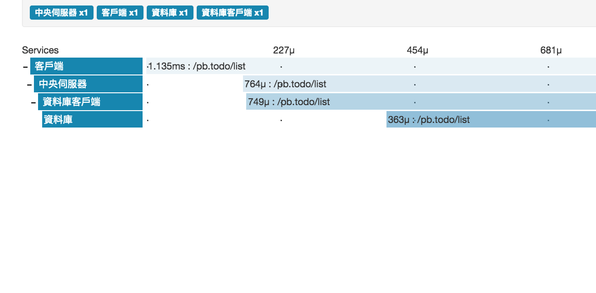

# grpc-opentracing

這個範例衍生於 `grpc-fixed-lb`，這是用來示範在分布式系統（與負載平衡）中如何追蹤函式的呼叫和花費時間，為了執行這個範例，你必須安裝 [OpenTracing](http://opentracing.io/)。

## 範例

```bash
# 啟動兩個資料庫服務實例，分別在 50050 和 50052 埠口上部署。
go run ./database/main.go 50050
go run ./database/main.go 50052
# 接著啟動工作記事服務並傳入兩個資料庫實例地址來進行負載平衡。
go run ./server/main.go "localhost:50050, localhost:50052"
# 然後開啟客戶端呼叫服務函式。
go run ./client/main.go
```

```bash
2017/03/12 06:35:38 Add 結果：測試, 這是測試的內容。
2017/03/12 06:35:38 List 結果：{"tasks":[{"title":"測試","content":"這是測試的內容。"}]}
```

## 螢幕截圖

執行完畢後進入 `http://localhost:9411/traces/` 查看追蹤過程。



## Protobuf

```proto
// Todo 是一個提供存放工作記事的服務。
service Todo {
    rpc Add(Task)  returns (Task)  {}
    rpc List(Void) returns (Tasks) {}
}

// Void 呈現一個什麼都沒有的資料。
message Void {
}

// Task 是單個工作記事資料。
message Task {
    string title   = 1;
    string content = 2;
}

// Tasks 會回傳多個工作記事資料。
message Tasks {
    repeated Task tasks = 1;
}
```
